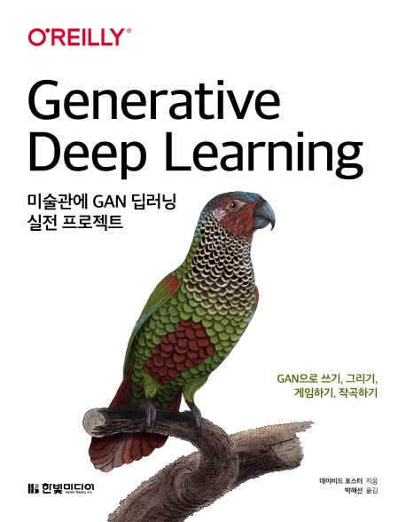

# <미술관에 GAN 딥러닝 실전 프로젝트> 한빛미디어, 박해선 옮김
이 저장소는 한빛미디어의 <미술관에 GAN 딥러닝> 책을 기반으로 공부하는 곳입니다.
Google의 COLAB을 사용한 환경에서 진행하였습니다.   

[저자 유튜브 채널](https://www.youtube.com/c/HaesunPark_ML/)
## 공부 목차
- 1부 : 생성 딥러닝
    - 1장: 생성 모델링
    - 2장: 딥러닝
    - 3장: VAE - 변이형 오토인코더'
    - 4장: GAN - 생성적 적대 신경망
- 2부 : 컴퓨터에게 그리기, 글쓰기, 작곡하기, 게임을 가르치기
    - 5장: 그리기
    - 6장: 쓰기
    - 7장: 작곡하기
    - 8장: 게임하기
    - 9장: 생성 모델링의 미래
    - 10장: 결론
